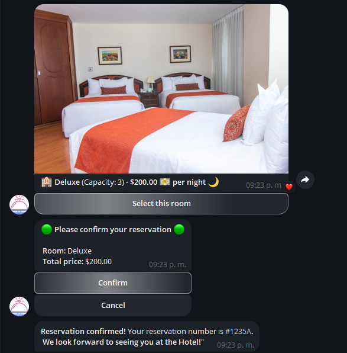
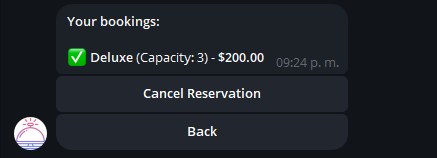
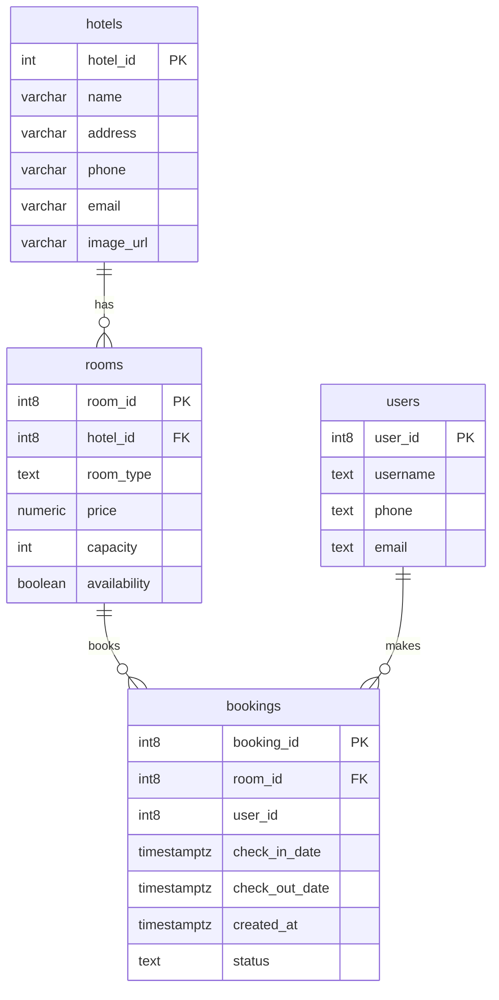

# Hotel-Bot: Chatbot for Telegram

Hot-Bot es un chatbot de Telegram que automatiza el proceso de reservación de habitaciones para un hotel, permitiendo a los usuarios verificar disponibilidad, hacer y cancelar reservaciones, y consultar información de contacto del hotel. Este proyecto es simple, intuitivo y fácil de expandir.

---


---
## Índice

- [Características](#características)
- [Tecnologías](#tecnologías)
- [Requisitos](#requisitos)
- [Instalación](#instalación)
- [Configuración](#configuración)
- [Comandos Disponibles](#comandos-disponibles)
- [Ejemplo de Uso](#ejemplo-de-uso)
- [Base de Datos](#base-de-datos)
- [Licencia](#licencia)

## Características

- **Reserva de habitaciones**: Los usuarios pueden consultar la disponibilidad de habitaciones, ver opciones con fotos y descripciones, y realizar reservas.
- **Gestión de Reservas**: Los usuarios pueden revisar y cancelar sus reservaciones.
- **Información de Contacto**: Los usuarios pueden acceder a los datos de contacto del hotel.
- **Interfaz Visual**: Uso de botones interactivos y fotografías para mejorar la experiencia del usuario.

## Tecnologías

- **Lenguaje**: Python
- **Framework**: Python-Telegram-Bot
- **Base de Datos**: MySQL

## Requisitos

- Python 3.7 o superior
- MySQL
- Cuenta de Bot en Telegram (Obtenida a través del BotFather)

## Instalación

1. **Clonar el Repositorio**  
   ```bash
   git clone https://github.com/Felipe-SANp/Hotel-Bot.git
   cd hot-bot
   ```

2. **Instalar Dependencias**  
   Recomendado: Crear un entorno virtual
   ```bash
   python3 -m venv venv
   source venv/bin/activate
   pip install -r resources/requirements.txt
   ```

3. **Configurar la Base de Datos**  
   Crea las tablas necesarias en MySQL. En un archivo `hot_bot.sql` para crear la estructura de tablas (`hotels`, `rooms`, `bookings`, `users`).

## Configuración

1. **Token de Telegram**  
   Crea un archivo `.env` en la carpeta `resources` con el siguiente contenido, reemplazando `YOUR_TELEGRAM_BOT_TOKEN` con tu token de Telegram:
   ```plaintext
   MYTOKEN='YOUR_TELEGRAM_BOT_TOKEN'
   ```

2. **Credenciales de Base de Datos**  
   Configura las credenciales de MySQL en el archivo [conectDB.py](resources/conectDB.py) ubicada en la carpeta `resources`:
   ```plaintext
   host=localhost
   user=tu_usuario
   password=tu_contraseña
   database=hot_bot
   ```

## Comandos Disponibles

Hot-Bot ofrece los siguientes comandos para facilitar la interacción:

- `/start` - Muestra la bienvenida y un resumen de las opciones.

## Ejemplo de Uso

1. **Iniciar Conversación**: El usuario inicia la interacción con `/start`.
2. **Consultar Disponibilidad**: El usuario puede verificar las habitaciones disponibles.
3. **Reservar Habitación**: Si encuentra una opción adecuada, el usuario puede hacer una reserva.
4. **Cancelar Reservación**: En caso de necesitarlo, el usuario puede cancelar su reserva.

### Capturas de Pantalla







## Base de Datos

La base de datos consta de las siguientes tablas:

- **hotels**: Información de los hoteles disponibles.
- **rooms**: Detalles de cada habitación (tipo, precio, capacidad).
- **bookings**: Registro de todas las reservaciones realizadas.
- **users**: Datos de los usuarios que realizan las reservaciones.

Ejemplo de diagrama relacional de la base de datos: 


## Licencia

Este proyecto está bajo la licencia GNU GENERAL PUBLIC LICENSE. Consulta el archivo [LICENSE](LICENSE) para más detalles.

---
