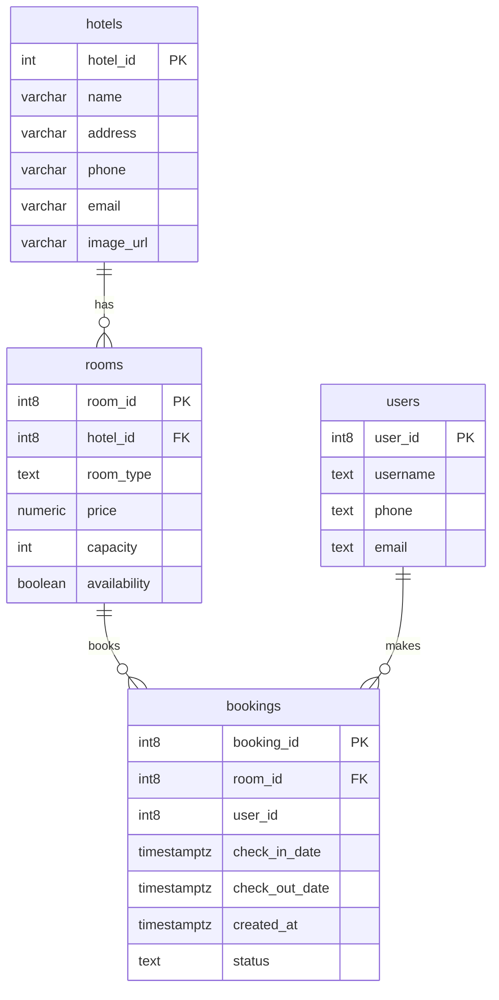

```mermaid
erDiagram  
    hotels {  
        int hotel_id PK  
        varchar name    
        varchar address  
        varchar phone  
        varchar email  
        varchar image_url  
    }  
    rooms {  
        int8 room_id PK  
        int8 hotel_id FK  
        text room_type  
        numeric price  
        int capacity  
        boolean availability  
    }  
    bookings {  
        int8 booking_id PK  
        int8 room_id FK  
        int8 user_id  
        timestamptz check_in_date  
        timestamptz check_out_date  
        timestamptz created_at  
        text status  
    }  
    users {  
        int8 user_id PK  
        text username  
        text phone  
        text email  
    }  
  
    hotels ||--o{ rooms : has  
    rooms ||--o{ bookings : books  
    users ||--o{ bookings : makes  
```
